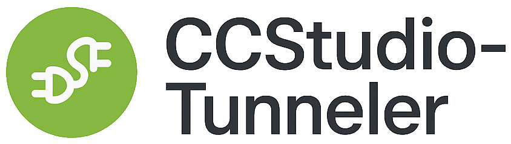

# CCStudio-Tunneler



**OPC DA to OPC UA Bridge for Modern Building Automation Systems**

CCStudio-Tunneler enables legacy OPC DA (DCOM-based) devices and systems to communicate with modern OPC UA clients across your local network, including Linux machines and cloud-based systems like Mango M2M2.

## Features

- **Protocol Bridge**: Seamlessly converts OPC DA to OPC UA
- **Cross-Platform Access**: Enable Linux and other platforms to access Windows-only OPC DA servers
- **Bidirectional Communication**: Full read and write support
- **Windows Service**: Runs automatically on system startup
- **System Tray Interface**: Easy configuration and monitoring
- **Tag Management**: Browse, filter, and alias OPC DA tags
- **Reliable**: Automatic reconnection and error recovery
- **Lightweight**: Minimal resource footprint

## Use Cases

- Connect Mango M2M2 to legacy OPC DA devices
- Integrate OPC DA data into custom Building Automation Software
- Enable remote monitoring of OPC DA systems
- Modernize legacy industrial control systems

## Installation

### Requirements

- Windows 10/11 or Windows Server 2016+
- .NET 8.0 Runtime or later
- OPC Core Components 3.0 (for OPC DA)
- Administrator rights (for service installation)

### MSI Installer (Recommended)

1. Download the latest `CCStudio-Tunneler-Setup.msi` from [Releases](https://github.com/yourusername/CCStudio-Tunneler/releases)
2. Run the installer as Administrator
3. Follow the installation wizard
4. The service will start automatically

### Portable Version

1. Download `CCStudio-Tunneler-Portable.zip`
2. Extract to your desired location
3. Run `CCStudio.Tunneler.TrayApp.exe` as Administrator
4. Configure and start the service from the system tray

## Quick Start

1. **Launch the Configuration UI** from the system tray icon
2. **Configure OPC DA Source**:
   - Select your OPC DA server from the dropdown
   - Test the connection
   - Browse and select tags to expose
3. **Configure OPC UA Server**:
   - Set the port (default: 4840)
   - Configure security settings
   - Set authentication (Anonymous or Username/Password)
4. **Apply and Start** the service
5. **Connect your OPC UA client** to `opc.tcp://[your-ip]:4840`

## Configuration

Configuration is stored in JSON format at:
```
C:\ProgramData\DHC Automation\CCStudio-Tunneler\config.json
```

### Example Configuration

```json
{
  "OpcDa": {
    "ServerProgId": "Matrikon.OPC.Simulation.1",
    "ServerHost": "localhost",
    "UpdateRate": 1000,
    "Tags": ["*"]
  },
  "OpcUa": {
    "ServerPort": 4840,
    "ServerName": "CCStudio Tunneler",
    "EndpointUrl": "opc.tcp://localhost:4840",
    "SecurityMode": "None",
    "AllowAnonymous": true
  }
}
```

## System Requirements

- **OS**: Windows 10/11, Windows Server 2016+
- **.NET**: .NET 8.0 Runtime or later
- **RAM**: 256 MB minimum, 512 MB recommended
- **Disk**: 50 MB for installation
- **Network**: TCP port 4840 (configurable)

## Architecture

CCStudio-Tunneler consists of three components:

1. **CCStudio.Tunneler.Service** - Windows service handling OPC communication
2. **CCStudio.Tunneler.TrayApp** - WPF application for configuration and monitoring
3. **CCStudio.Tunneler.Core** - Shared library with models and utilities

## Firewall Configuration

The installer automatically creates firewall rules, but if needed manually:

```powershell
New-NetFirewallRule -DisplayName "CCStudio-Tunneler" -Direction Inbound -Protocol TCP -LocalPort 4840 -Action Allow
```

## Troubleshooting

### Service won't start
- Verify OPC Core Components are installed
- Check Windows Event Viewer for detailed errors
- Ensure the OPC DA server is running and accessible

### Can't connect from OPC UA client
- Verify firewall rules allow port 4840
- Check the OPC UA endpoint URL matches your network configuration
- Ensure security settings match between server and client

### Tags not updating
- Check the update rate in configuration
- Verify OPC DA server connection is active
- Review logs in `C:\ProgramData\DHC Automation\CCStudio-Tunneler\Logs`

## Support

- **Documentation**: [User Guide](docs/UserGuide.md)
- **Issues**: [GitHub Issues](https://github.com/yourusername/CCStudio-Tunneler/issues)
- **Email**: support@dhcautomation.com

## Development

### Building from Source

```bash
git clone https://github.com/yourusername/CCStudio-Tunneler.git
cd CCStudio-Tunneler
dotnet restore
dotnet build
```

**Requirements for Development:**
- .NET 8.0 SDK: https://dotnet.microsoft.com/download/dotnet/8.0

### Running Tests

```bash
dotnet test
```

## License

MIT License - see [LICENSE](LICENSE) file for details

## About

**CCStudio-Tunneler** is developed by **DHC Automation and Controls**

Bridging the gap between legacy and modern automation systems.

---

Made with care for the Building Automation community
